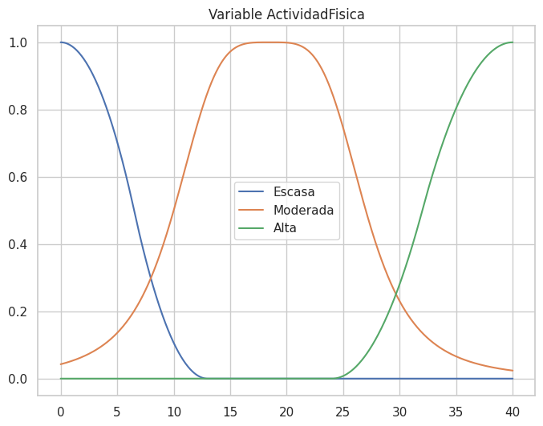
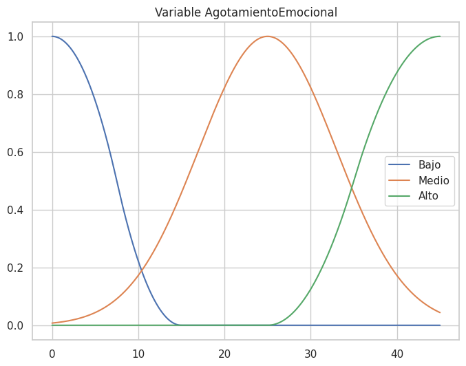
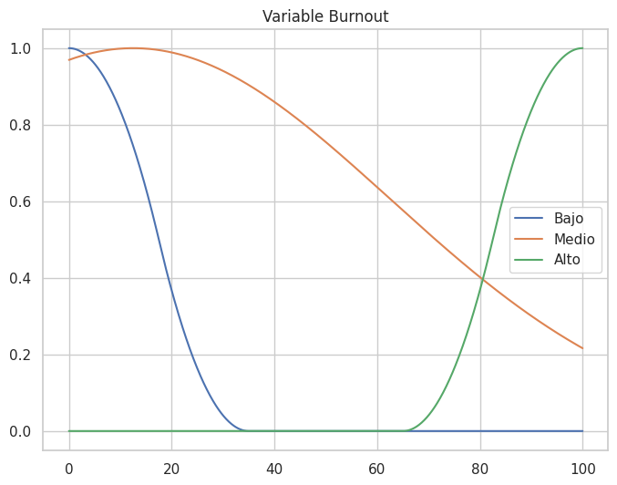
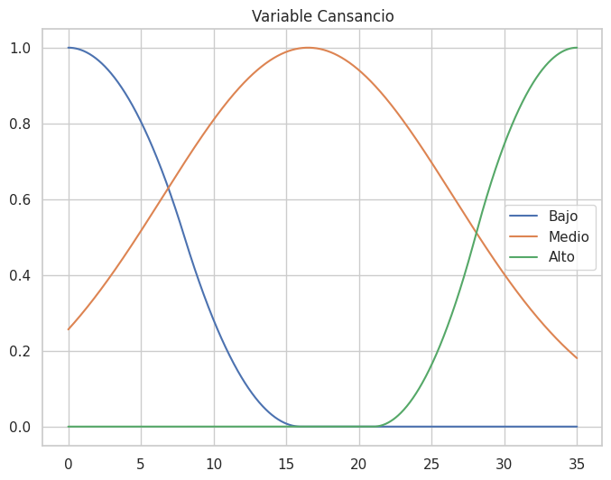
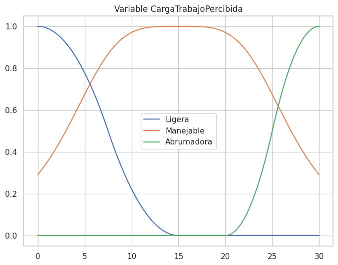
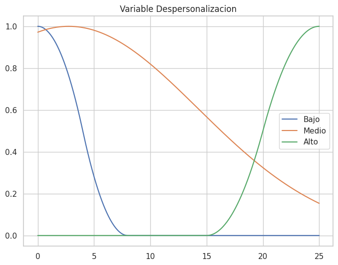
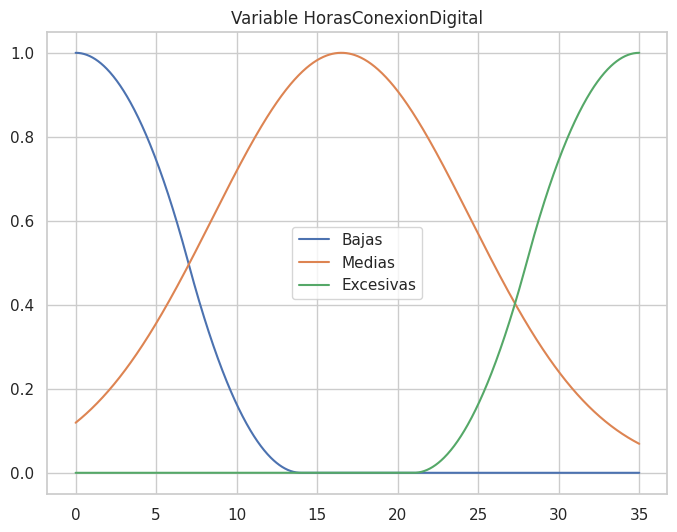
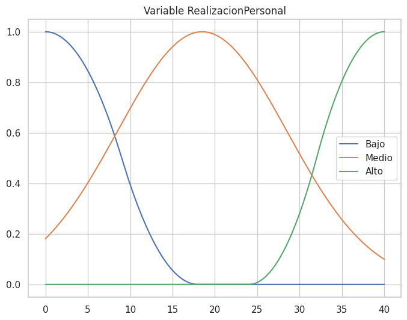
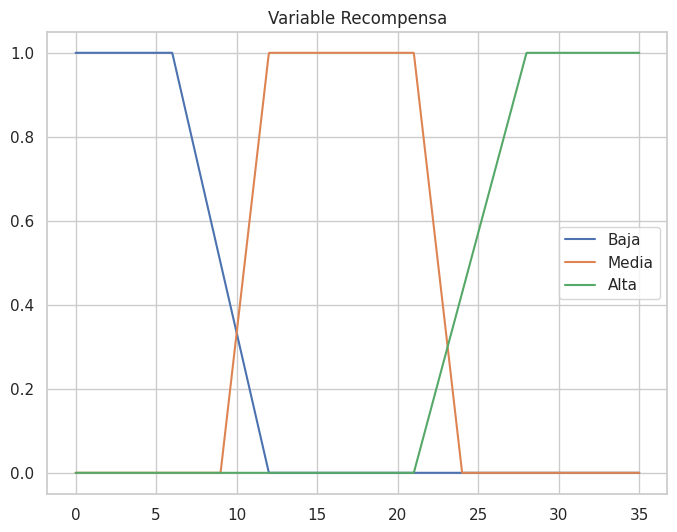
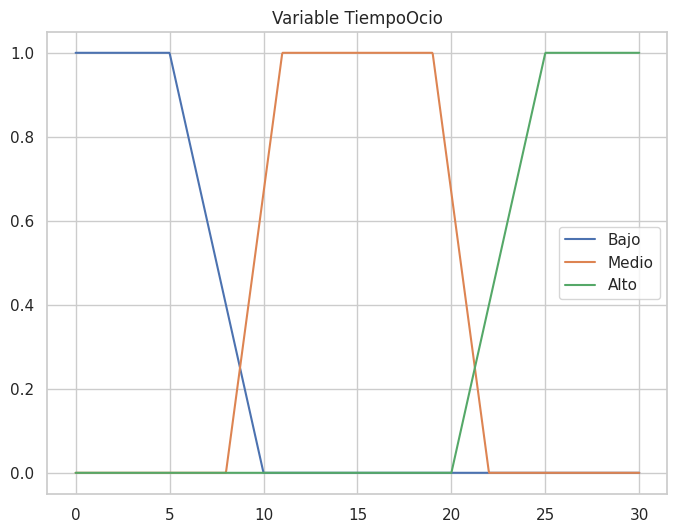

# BurnoutExys

[](https://github.com/Stefano-UA/SistemaExperto/actions/workflows/build.yaml)
[](https://github.com/Stefano-UA/SistemaExperto/actions/workflows/test.yml)
[](https://stefano-ua.github.io/SistemaExperto/)

Intelligent decision support model designed to measure vital exhaustion (Burnout) and job satisfaction in digital environments. This system resolves the fuzzy transition between healthy stress and toxic burnout by contrasting deterministic scientific standards (Maslach Burnout Inventory - MBI) with a highly configurable Fuzzy Logic inference engine.

## Overview

The core goal of this project is to provide a robust, interactive terminal interface that evaluates raw survey data through two distinct paradigms:
1.  **Deterministic Engine (`MBIEngine`)**: Applies rigid threshold logic based on the standard Maslach Burnout Inventory.
2.  **Fuzzy Engine (`FuzzyEngine`)**: Applies degrees of truth using user-defined linguistic variables, mathematical universes, and Abstract Syntax Tree (AST) logical rules.

The system is built on a clean software architecture utilizing the **Strategy Pattern** for dynamic engine swapping and the **Template Method Pattern** for standardized data pipeline evaluation.

## How It Works

The application operates via an interactive terminal loop. The typical execution flow is:

1.  **Load Data**: Ingest raw `.csv` survey data containing questionnaire responses.
2.  **Load Mappings**: Ingest a `.map` file to translate long, descriptive CSV columns into standardized internal IDs (e.g., `AgotamientoEmocional`). The system automatically groups and aggregates values by these IDs.
3.  **Load Variables**: Ingest a `.vars` file containing Domain Specific Language (DSL) definitions of fuzzy linguistic variables (e.g., *Exhaustion*, *Burnout*), their mathematical ranges (universes), and their membership functions (e.g., *low*, *medium*, *high* using trapezoidal or gaussian curves).
4.  **Load Rules**: Ingest a `.rules` file defining the IF-THEN logic using `AND`, `OR`, and `NOT` operators.
5.  **Execute Inference**: Process the data row-by-row using the selected engine.
6.  **Generate Visualizations**: Render the results as 2D plots (individual variables, defuzzification surface areas, or model comparisons).

## Repository Structure

```text
.
├── .github/workflows/    # CI/CD pipelines (Build, Test, Docs)
├── assets/               # Branding and static resources (Icons)
├── data/                 # Example datasets and DSL configuration files
├── docs/                 # Sphinx documentation configuration
├── scripts/              # Developer automation suite (Bash)
├── src/                  # Application source code
│   ├── data/             # State container and DSL parsers
│   ├── evaluation/       # Cross-engine metrics (MAE/MSE)
│   ├── inference/        # Base engines, MBI, Fuzzy, and AST logic
│   ├── ui/               # Controller, Menu, and interactive views
│   └── visualization/    # Matplotlib & Seaborn 2D plotters
│   └── main.py           # Application entry point
├── test/                 # Pytest unit testing suite
├── visuals/              # Output directory for generated plots
├── CITATION.cff          # Metadata for academic & software citation
├── requirements.txt      # Python dependencies
└── .env.example          # Environment variables template
```

## Example Data

The repository includes a ready-to-use dataset in the `data/` directory to demonstrate the system's capabilities:

- **`Burnout.csv`**: Sample dataset of 35 responses to a burnout survey.
- **`Mappings.map`**: Maps the specific survey questions (columns) from the CSV to the variables defined in `Variables.vars`.
- **`Variables.vars`**: Defines the fuzzy universes and `skfuzzy` membership functions (e.g., `trapmf`, `zmf`) for the survey inputs and the final output *Burnout*, which must be last.
- **`Engine.rules`**: Contains the logical AST fuzzy rules.

## Getting Started

### Prerequisites
- **Python**: Version `3.12` or higher.
- **Linux/Unix** environment recommended for the bash scripts.

### Installation
1. Clone the repository:
   ```bash
   git clone https://github.com/Stefano-UA/SistemaExperto.git
   cd SistemaExperto
   ```
2. Initialize the environment:
   ```bash
   ./scripts/init.sh
   ```
   *This script creates the `.venv`, copies `.env.example` to `.env`, and installs all dependencies.*

### Execution
Launch the interactive terminal application:
```bash
./scripts/run.sh
```

## Developer Tooling

The `scripts/` directory contains bash scripts to automate the development lifecycle:

| Script | Description |
| :----: | :---------- |
| `init.sh` | Sets up the virtual environment and installs dependencies. |
| `run.sh` | Starts the main interactive CLI application. |
| `test.sh` | Executes the `pytest` unit testing suite. |
| `coverage.sh` | Runs tests and generates a terminal coverage report. |
| `docs.sh` | Compiles the Sphinx HTML and LaTeX/PDF documentation. |
| `readme.sh` | Generates the README.md adding dynamic information like the visualizations. |

## Visual Showcase

When the `Generate Visualizations` option is triggered in the CLI, the system outputs high-quality `.png` assets to the `visuals/` directory.

*(Placeholders for future graphical inserts)*
*   **Membership Functions**: Visualizes the curves defining 'Low', 'Mid', 'High' across a variable's universe.
*   **Defuzzification**: Shows the aggregated area of activated rules and the centroid cut-off for a specific data row.
*   **Model Comparison**: A scatter plot contrasting MBI vs. Fuzzy logic evaluations, highlighting Mean Absolute Error (MAE) and Mean Squared Error (MSE).

### Membership Functions

<p align="center">
  
  
  
  
  
  
  
  
  
  
</p>
